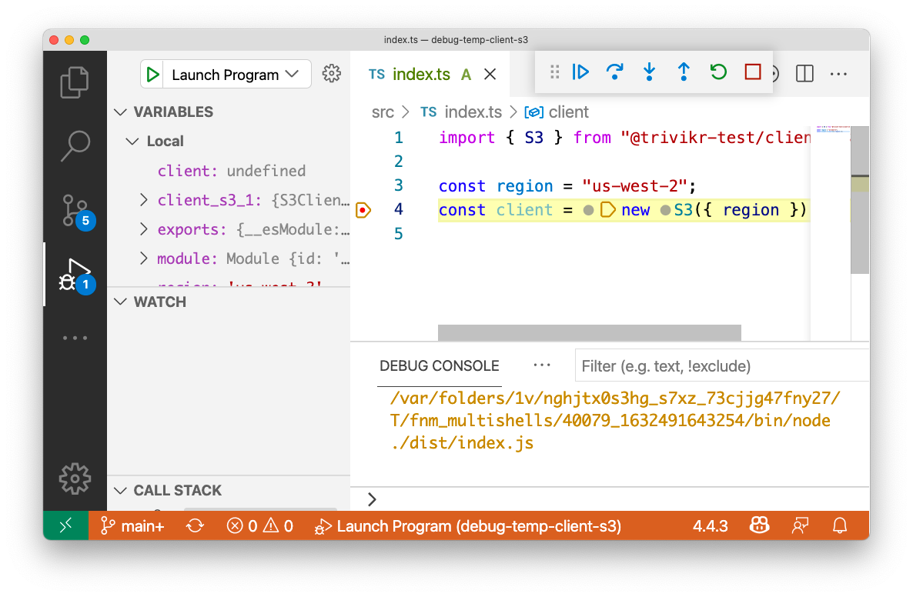
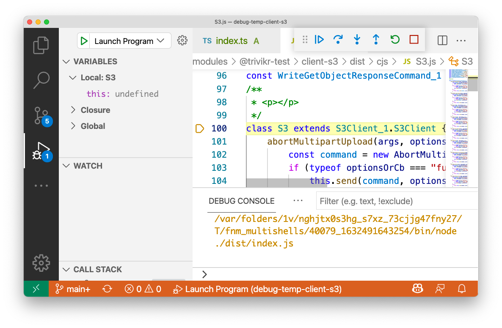

# debug-temp-client-s3

VSCode debug setup for [@trivikr-test/client-s3](https://www.npmjs.com/package/@trivikr-test/client-s3)

Steps to follow;

- Clone this package.
- Run `yarn` to install dependencies.
- Open source in VSCode.
- Set breakpoint on the line in `src/index.ts` which creates the S3 client.
- Click on `Launch Program` in the debug toolbar.

## Screenshots

When debugger stops at breakpoint

On clicking step into for S3

